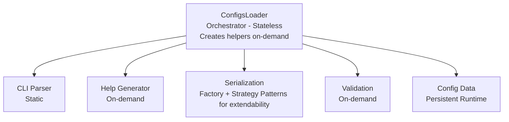

# ConfigsLoader C++

A modern, compile-time optimized configuration management library for C++20.

## TL;DR

ConfigsLoader delivers **high-performance configuration management**, while **putting an emphasis on developer experience**, and **end-user experience** 

**Performance**: Direct memory access + minimal memory footprint after init  
**Developer**: Type-safe structs, hierarchical configs, input validation & simple API  
**End-User**: Interactive help, preset files, validation errors with descriptions


## Quick Start

```cpp
#include "configs_loader.hpp"

struct MyConfig {
    Config<std::string> input{
        .default_value = "input.txt",
        .flags = {"--input", "-i"},
        .required = true,
        .description = "Input file path"
    };
    REGISTER_CONFIG_FIELDS(input)
};

int main(int argc, char* argv[]) {
    ConfigsLoader<MyConfig> loader;
    if (loader.init(argc, argv) != 0) {
        return 1;
    }
    
    std::string input = loader.configs.input.value;
    // ... business logic
    return 0;
}
```

**See [examples/](examples/) for more features and realistic use-cases:**
- [01_basic](examples/01_basic/) - Minimal example
- [02_cli](examples/02_cli/) - CLI argument parsing
- [03_help](examples/03_help/) - Help generation features
- [05_hierarchy](examples/05_hierarchy/) - Hierarchical configurations
- [07_real_world](examples/07_real_world/) - Complete application example


## Building

```bash
mkdir build && cd build
cmake .. -DENABLE_TOML_PRESETS=ON
cmake --build .
ctest  # Run 63 tests
```


## Requirements

- C++20 or later
- CMake 3.14+
- Optional: toml++ for TOML preset support


## Design Philosophy & Implementation Approach 
The philosophy can be summed up in one sentence - `Data-Oriented Design` for performance in the hot path, `Object-Oriented Programming` for extensibility & maintainability in other cases.

### Make the Common Case Go Brrrr

In my personal experience with configuration libraries, I haven't found one that provides the combination of features I wanted: high-performance for reading configs (the common case), ease of use for developers writing the code, and good **auto-generated** --help experience, similar to python's argparse (but with more features).

**The common case**: Reading configuration values during program execution.

```cpp
// Translates to a single ASM instruction: ldr w0, [x0, #96]
int timeout = loader.configs.server.timeout.value;
```

Configuration structure is known at compile time, yet most implementations I've encountered use runtime lookups - searching for config names in maps or similar structures. This pays a cost in the hot path for knowledge already available at compile time. 

Instead, this library utilizes compile-time knowledge for performance boosts via direct memory access.

### Focus on User Experience for Non-Critical Paths

While optimizing the hot path, the library focuses on ease of use for non-performance-critical scenarios like initialization, updating configs and user interaction. This is mainly expressed in the API and internal design for all features other than configuration reads (configuration updates, input validation, help generation, etc.).


## Features by User

### For Performance-Critical Applications

**Direct Memory Access**

Direct struct member access. The compiler optimizes this to a single load instruction with a known offset.

```cpp
// Compiles to: ldr w0, [x0, #96]
int value = loader.configs.server.port.value;
```

**Minimal Runtime Memory Footprint**

After initialization, only config structs and an initialization flag remain in memory. All parsing, validation, and application logic is destroyed before the business logic program runs.

**Assembly-Verified Zero Cost**

All convenience features compile to identical assembly as direct access:

```cpp
// Three ways to access nested config value:
int v1 = loader.configs.group.config.value.value;           // Direct
const NestedConfig& nested = loader.configs.group;          // Implicit conversion
int v2 = nested.value.value;

// Both compile to identical assembly:
ldr w0, [x0, #96]
ret

// Helper method also optimizes away:
std::string name = loader.configs.group.get_name();

// Compiles to:
add x0, x0, #104
ret
```

### For Developers

**Type-Safe Hierarchical Configurations**

```cpp
struct DatabaseConfig {
    Config<std::string> host{.default_value = "localhost"};
    Config<int> port{.default_value = 5432};
    REGISTER_CONFIG_FIELDS(host, port)
};

struct ServerConfig {
    ConfigGroup<DatabaseConfig> primary_db{.name_ = "primary_db"};
    ConfigGroup<DatabaseConfig> replica_db{.name_ = "replica_db"};
    REGISTER_CONFIG_FIELDS(primary_db, replica_db)
};
```

**Compile-Time Name Validation**

Most libraries I've encountered use string-based access:

```cpp
// Runtime string-based (typo fails at runtime):
int timeout = config.get<int>("server.timout");
```

This library uses struct-based access for compile-time validation:

```cpp
// Struct-based (typo caught at compile time):
int timeout = loader.configs.server.timout.value; // Compile error
```

Shift-left approach: catch errors during compilation, not during execution. IDE autocomplete now works on config names as well.

**Partial Initialization**

Override only what differs from defaults:

```cpp
ConfigGroup<ServerConfig> api_server{
    .config = {
        .port = {.default_value = 8080}  // Override just port
    },
    .name_ = "api_server"
};
```

Note: This feature requires C++20 (designated initializers). Without partial initialization, the library could support earlier C++ standards.

**Input Validation Per Field**

Validation runs during value updates (primarily during init). Failed validations are reported to the user with config descriptions:

```cpp
Config<int> port{
    .default_value = 8080,
    .flags = {"--port"},
    .description = "Server listening port",
    .required = true,
    .verifier = [](int p) { return p > 0 && p < 65536; }
};
```

**Print Configuration**

```cpp
// Print only changes (for minimal presets)
std::cout << loader.dump_configs(SerializationFormat::TOML, true);

// Print all values
std::cout << loader.dump_configs(SerializationFormat::TOML, false);
```

Via CLI:
```bash
./myapp --port 9090 --print-config > config.toml              # Only changes
./myapp --port 9090 --print-config-verbose > full-config.toml # All values
```

**Custom Help Formatting**

```cpp
HelpFormat custom{
    .program_name = "my-tool",
    .use_colors = false,
    .max_width = 100
};

std::string help = loader.generate_help("", std::cref(custom));
```

### For End Users

**Built-in Flags**

The library provides several reserved flags:

- `--help, -h` - Show help message (exits after displaying)
- `--preset <file>` - Load configuration from preset file
- `--print-config` - Print current config to stdout (only changes from defaults)
- `--print-config-verbose` - Print current config to stdout (all values)


**Interactive Help System**

```bash
./myapp --help              # Navigation help
./myapp --help all          # All options (grep-friendly)
./myapp --help required     # Only required fields
./myapp --help database     # Only database group
```

Example output:
```
Usage: ./myapp [OPTIONS] --input <string>

Options:
  --help, -h   <void>  Show this help message
  --preset <file>  Load configuration from file
  [Required] --input, -i  <string>  Input file path (default: "input.txt")
  --output, -o  <string>  Output file path (default: "output.txt")
  --verbose, -v  <bool>  Enable verbose output (default: false)
```

**Current Values in Help**

After loading configs, help shows current state:

```bash
./myapp --port 9090 --help all
```

Output:
```
--port  <int>  Server port (current: 9090, default: 8080)
--host  <string>  Server host (default: "localhost")
```

**Preset Files with CLI Precedence**

Use preset files as base configuration, override with CLI arguments (CLI has precedence):

```toml
# production.toml
host = "prod.example.com"
port = 1234
timeout = 60
```

```bash
# Load preset, override port, check with help
./myapp --preset production.toml --port 5555 --help all
```

Output shows current values from both preset and CLI:
```
--host    <string>  Server host (current: "prod.example.com", default: "localhost")
--port    <int>     Server port (current: 5555, default: 8080)
--timeout <int>     Request timeout (current: 60, default: 30)
```


**All Errors Reported Together**

Solves the frustrating flow of "fix 1 issue, rerun, next error, rerun, next error...". All validation and application errors collected and shown at once:

```
Configuration validation failed with 2 error(s):

  • Required field '--host' is not set [Server hostname]
  • Required field '--port' is not set [Server listening port]

Configuration application failed with 1 error(s):

  • Validation failed for field '--timeout' [Request timeout]: value = -5
```


**Preset Building Loop**

Iteratively build and refine preset files:

```bash
# 1. Start with defaults, print only changes
./myapp --port 8080 --host localhost --print-config > base.toml

# 2. Load base, add overrides, print changes
./myapp --preset base.toml --timeout 60 --print-config > prod.toml

# 3. Use production preset
./myapp --preset prod.toml

# 4. Print all values (verbose)
./myapp --preset prod.toml --print-config-verbose > full-config.toml
```

**Flexible CLI Syntax**

Multiple syntax styles supported:

```bash
# Space-separated
./myapp --host localhost --port 8080

# Equals syntax
./myapp --host=localhost --port=8080

# Short flags
./myapp -h localhost --port 8080

# Mixed
./myapp --host=localhost --port 8080 --verbose true
```


## Performance Characteristics

| Operation | Complexity | Notes |
|-----------|-----------|-------|
| Read config value | O(1) | Direct memory access, single instruction |
| Init (parse + validate) | O(n + f) | n=argc, f=fields (once at startup) |
| Help generation | O(f) | f=fields (only when requested) |
| Serialization | O(f) | f=fields (only when requested) |


## Module Architecture



**Initialization (Once)**: Parser, Validator, Applier created and destroyed  
**Runtime (Always)**: Only Config structs (Config&lt;T&gt;, ConfigGroup&lt;T&gt;) + initialization flag remain  
**On-Demand**: Help generator, serializers created when needed

Serialization uses Factory pattern for creation and Strategy pattern for format extensibility.

Initialization helpers are ephemeral to minimize memory footprint during business logic execution.


## Design Decisions

### Why Require Manual init() and Not Use a Singleton?

The manual initialization pattern indeed isn't the common practice - it separates memory allocation from initialization. It's even discussed in books like "Beautiful C++: 30 Core Guidelines". However, the primary reason is performance - I can easily reason here what would be the common case and optimize for it.

Singletons require checking `is_initialized()` before **every** API call:

```cpp
// Singleton pattern:
Config& Config::instance() {
    if (!initialized) { initialize(); }  // Branch on every call
    return config;
}
```


This is a cost paid on every access to the API to handle a state that only happens once - the first API call, where the singleton **maybe** isn't initialized yet.

Even with branch prediction accounted for, this is wasted work in the hot path & common case. Instead, this ConfigsLoader is statically initialized with the default constructor (and the compiler can know the address of the "singleton" at compile-time). Afterwards we have the user-initialized ConfigsLoader with `init(argc, argv)`. More wasteful for the rare case, better for the common case.

This is inspired by the "root node" anecdote from Mike Acton's C++Con 2014 talk ["Data-Oriented Design and C++"](https://youtu.be/rX0ItVEVjHc?si=NY5uPFXobrB7f8lb&t=3990) (~1:06:30).

### Why Not Runtime Reflection?

Runtime reflection requires hash maps, string lookups, and type erasure. This pays a cost in the hot path for knowledge already available at compile time - a missed opportunity data-oriented design wise.

Struct-based design allows:
- **Compile-time checking**: Typos caught by compiler, IDE autocomplete works
- **Direct memory access**: Compiler optimizes to single instruction
- **Zero runtime cost**: No lookups, no string comparisons

### Why No Inheritance for Config/ConfigGroup?

Inheritance was my first solution because there's no vtable overhead when there's no virtual functionality in the hierarchy. However, C++ doesn't allow designated initializers on types with base classes. I prefer the better developer experience with partial initialization to only change default values of repeated config structs at the cost of lib-internal function overloading. 


## [[maybe_unused]] Future Enhancements

**C++26 Reflection:**
- Automatic field registration (no macros)
- Compile-time flag conflict detection

**Additional Formats:**
- JSON preset support
- YAML preset support
- Multiple preset file support (layered configs)

**Runtime Updates:**
- Signal listener for config reload (SIGHUP)
- Pub/sub for config change notifications
- Useful when holding config by value instead of reference

## License

See LICENSE file.
